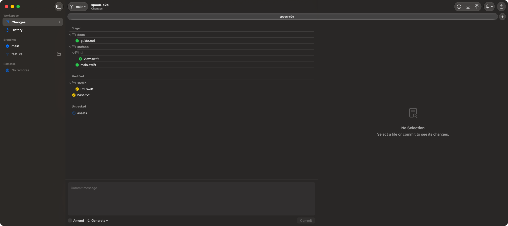

# Spoon

An AI-first git client for macOS, built with SwiftUI for macOS 27 (Golden Gate).



## Features

- **Changes** — stage / unstage whole files, hunks, or individually selected
  lines. Multi-select with ⌘/⇧, double-click or press Return to move files,
  drag & drop between areas, discard selected lines, right-click to open a
  file or reveal it in Finder.
- **History** — commit graph with infinite scroll; commit details show the
  full patch with selectable, copyable lines.
- **Interactive rebase** — pick / squash / drop / edit from a commit's
  context menu, plus cherry-pick and revert. Conflicts and edit stops show a
  banner with Continue / Skip / Abort.
- **Branches** — create, delete, and check out branches; link a branch to
  its own worktree (add / open in a new window / remove).
- **Stashes** — save (including untracked files), browse a stash's diff,
  apply, pop, or drop it.
- **Pull requests** — branches display their open GitHub PR with review and
  CI status; a PR list and detail view come from the GitHub GraphQL API.
- **AI** — generate commit messages and review branches with Claude Code or
  Codex, running the CLIs you already have installed.
- **Shortcuts** — App Intents for “Open Repository” and “Stash Changes”.
- Auto-refresh via FSEvents, repository-titled windows and tabs.

## Requirements

- macOS 27 (Golden Gate) or later
- `git` (Xcode Command Line Tools are enough)
- Optional, for the matching features:
  - [`gh`](https://cli.github.com) — GitHub authentication for PR sync
  - [`claude`](https://claude.com/claude-code) and/or `codex` — AI commit
    messages and reviews

## Building

Open `Spoon.xcodeproj` with Xcode 27 and run the **Spoon** scheme.

Tests live in the SpoonKit package:

```sh
cd SpoonKit
swift test
```

## Architecture

- `SpoonKit/Sources/SpoonCore` — process runner, git engine (system git
  CLI), models, GitHub sync, AI providers, session state
- `SpoonKit/Sources/SpoonUI` — all SwiftUI views
- `SpoonKit/Sources/SpoonIntent` — App Intents
- `Spoon/` — the thin app target

## License

[Apache License 2.0](LICENSE)
